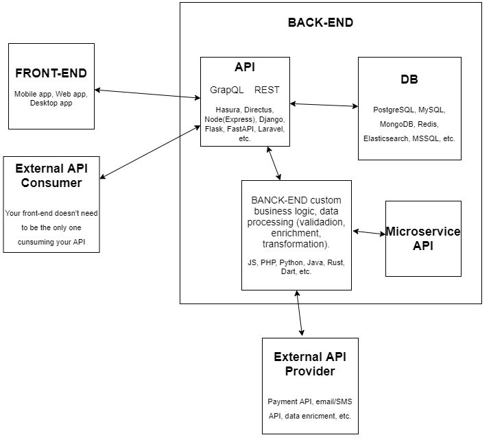

  

Front-end, Back-end & API in between then
=========================================

The front-end is the part of the app (web, mobile, or desktop application) that receives input from a client (user or external API consumer). Front-end also displays the information that it receives from the backend via API call. For example, it could receive from a back-end list of names (first name + last name) but it will display only the first name (will drop everything that is after the first space). such things could be also done in the back-end and it is actually suggested to do maximum amount in the back-end so that the front-end will just handle routs and make **UI** (user interface) look as beautiful as the **UI designer** thought it should be (right colors, illustrations, fonts, spacing, textures, etc., etc.)

Backend can be just a simple API for accessing the data from DB (database) and storing user input to the DB but in most cases, there's more complex business logic between the front-end and the database, and that is done by the back-end. Often back-end handles for example authentication, payment processing, information request from third-party APIs (eg. phone number lookup), sending transactional emails, SMS, getting information from physical sensors (GPS, camera, mic, gyroscope, etc), and much more.

Site rendering (generating HTML output) can happen both at the back-end (server-side) and at the front-end (client-side) level.  

As you can see in the middle there is API. Take API like a waiter in a restaurant. You are a front-end and then there are other people in the restaurant (external API consumers) and everybody will call the API to get the meal from the kitchen (back-end). API will check what you want, maybe format your request into an understandable format for the chefs, and then the kitchen (back-end) will get the ingredients from the DB, process it with custom restaurant's receipts (business logic), enrich it maybe with some external API maybe and then the API (waitress) will provide the processed meal back to you and any other external website, mobile app, whatever who has access to the API. API can be public and accessible to anybody eg. Google currency conversion, company name vs number check, etc. but most of the APIs require you to pay to have access like for example verify if the phone number or email address entered at signup exists, possibly get the company name from the visitors IP address, etc. Then you need usually some authentication details to access the API (API key, API secret, etc).

APIs are either **REST API**s that used to be for many years the only industry standard. Today more and more **GraphQL API** is used. The bonus of it is that you do not have multiple versions like REST has as you develop so all the API consumers need to re-write their code. It gives also more power to **FE** (front-end) guys that are often considered also as a minus when FE is junior and not that advanced. Today still many know REST but not GraphQL but it really takes you a couple of hrs to learn it. For **BE** (back-end) guys in most cases, GraphQL means fewer working hours.

**Hasura** - open-source API Engine. Real-time GraphQL (also REST) **BaaS** (Back-end as a Service) like for example Google Firebase that is free and very cheap in the beginning but gets pretty expensive pretty soon. [DIY in 5min and in $5 DigitalOcean server.](https://hasura.io/diy-graphql-baas/ "https://hasura.io/diy-graphql-baas/") TODO: 15min Hasura crash course to build without zero prior knowledge an e-shop where products are connected to blog posts. [More about Hasura>>](https://medium.com/crewnew-com/hasura-api-engine-elm-lets-go-bug-free-rapid-app-development-4f9630280d72 "https://medium.com/crewnew-com/hasura-api-engine-elm-lets-go-bug-free-rapid-app-development-4f9630280d72") ([in Estonian>>](https://medium.com/crewnew-ee/hasura-%C3%BClikiire-ja-bugivaba-back-end-api-arendus-6cc4bfab1996 "https://medium.com/crewnew-ee/hasura-%C3%BClikiire-ja-bugivaba-back-end-api-arendus-6cc4bfab1996"))

**Directus** - crappier Hasura + admin panel out of the box. For smaller projects can replace Hasura as it also provides out-of-the-box GraphQL (or REST) API like HAsura but is also an admin panel. For bigger projects, it is better to have Hasura for the API engine and Directus as an extra just for the admin panel. [See video>>](https://www.youtube.com/watch?v=BVKGgOeouk8&t=82s "https://www.youtube.com/watch?v=BVKGgOeouk8&t=82s")